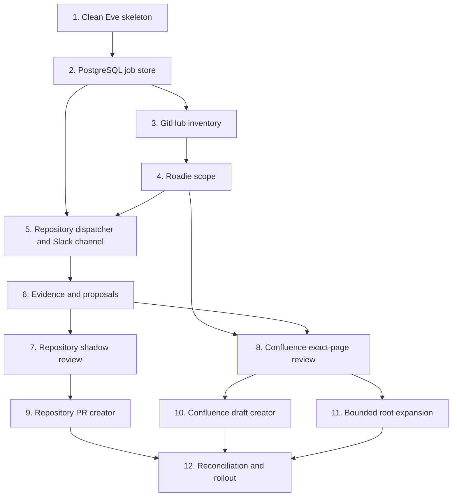

# Incremental Implementation Plan

Architecture and security decisions are defined in
[`system-plan.md`](./system-plan.md). This document defines implementation
order, pull-request boundaries, and validation checkpoints.

## Delivery rules

- Use one numbered task per Jira subtask and one pull request per task.
- Keep each pull request to one capability. Split it before implementation if
  it is likely to exceed five production files or roughly 600 changed lines,
  excluding generated lockfile and migration output.
- Every pull request adds tests for application-owned behavior where they
  provide ongoing regression value, and leaves `npm test`, `npm run typecheck`,
  `npm run build`, and `git diff --check` passing.
- Do not add fixtures or production code solely to verify behavior guaranteed
  by Eve's documented public contract.
- Validate model behavior through the production agent, instructions, and
  authored tools. Do not maintain a second scripted agent that duplicates the
  production review procedure for deterministic evals.
- During the POC, use focused tests for trusted application boundaries and
  recorded sandbox runs for agent judgment and external integration behavior.
- New execution paths default to disabled or shadow mode. A task may collect
  evidence and persist proposals before its artifact-creation path exists.
- The model cannot choose repositories, page IDs, Slack routes, or write
  inputs. Those values come from trusted session context and persisted
  records.
- Database changes are forward-only and independently deployable. New code
  must tolerate the previous deployment during a rolling release.
- Do not create Jira subtasks without explicit approval to mutate Jira.

## Clean-rebuild strategy

The existing single-repository prototype may be replaced. Git history is the
recovery mechanism; the implementation does not need a compatibility path.

The first implementation pull request will:

1. Preserve `.git`, repository guidance, `docs/system-plan.md`, this plan, and
   deployment metadata that is still required.
2. Remove the legacy schedule, 24-hour review-window workflow, hard-coded
   repository instructions, legacy Slack approval-card code, and
   model-visible GitHub write path.
3. Recreate a minimal Eve application that builds, exposes no external write
   capability, and has dangerous framework tools disabled.
4. Add new capabilities only through the numbered tasks below. Review and
   proposal generation remain shadow-only until their gated artifact creators
   are delivered.

Do not delete `.git`, the architecture documents, or repository instructions.
Resolve the exact removal set with a read-only file inventory before the first
implementation patch.

## Phase 1: Safe foundation

### Task 1: Replace the prototype with a safe Eve skeleton

**Goal:** Remove the legacy workflow and leave the smallest buildable base for
the new system.

**Boundaries:** Preserve Git history, architecture documents, repository
guidance, and required deployment metadata. Do not add schedules, external
connections, persistence, or drift behavior.

**Acceptance criteria:**

- The obsolete schedule, review-window logic, hard-coded repository workflow,
  legacy approval-card code, and GitHub write connection are removed.
- The replacement agent contains minimal static instructions, production route
  authentication, and explicit disables for dangerous default tools.
- Eve inspection proves that the skeleton has no schedule, subagent, external
  connection, or model-visible write capability.

**Verification:** `npm test`, `npm run typecheck`, `npm run build`, Eve info
inspection, and `git diff --check`. Review the removal list before applying it
and use Git history for recovery rather than retaining dead compatibility code.

**Likely files:** Existing `agent/` prototype files are removed; only the
minimal `agent/agent.ts`, `agent/instructions.md`, route-auth channel, tool
disable stubs, and focused safety tests remain.

**Dependencies / size:** None. Medium by file count but mostly deletions; added
production code should remain small.

## Phase 2: Deterministic control plane

### Task 2: Add PostgreSQL connectivity and the review-job store

**Goal:** Establish the smallest durable store needed for repository cursors,
jobs, leases, retries, and audit events.

**Boundaries:** Do not add proposal, HITL-outcome, or document-index
tables yet. Do not invoke a model.

**Acceptance criteria:**

- Migrations create repository registry, cursor, claim-invocation, review-job,
  and audit-event records with explicit constraints and timestamps.
- Claiming uses bounded batches, caller-supplied stable claim IDs, and expiring
  leases; concurrent workers cannot claim the same job, and retrying a claim
  cannot lease another batch.
- Enqueue, claim, complete, fail, and lease-recovery operations are idempotent.

**Verification:** Unit tests for state transitions and integration tests against
a disposable PostgreSQL database, including concurrent claims, lost-response
claim replay, empty-claim replay, parameter conflicts, and lease expiry.

**Likely files:** Prisma schema and migrations under `prisma/`, with focused
modules and tests under `agent/lib/database/`; keep connection setup, queue
policy, errors, and job persistence separate rather than growing a single
database module.

**Dependencies / size:** Task 1. Medium. Prisma 7 uses its PostgreSQL driver
adapter, with database-native SQL reserved for atomic queue operations that
need `FOR UPDATE SKIP LOCKED`. See
[`ADR-001`](./decisions/0001-prisma-postgresql-control-plane.md).

### Task 3: Synchronize the GitHub App repository inventory

**Goal:** Populate the registry from the GitHub App installation without model
involvement.

**Boundaries:** Capture repository identity, archive state, default branch, and
current head SHA only. Do not resolve Roadie or create jobs.

**Acceptance criteria:**

- The trusted client paginates every accessible installation repository.
- A repeat sync updates mutable metadata without duplicating repositories.
- Removed access and archived repositories become unschedulable without
  deleting their audit history.

**Verification:** Fixture-driven pagination, rename/archive, partial-failure,
and idempotency tests; one read-only pilot inventory.

**Likely files:** `agent/lib/github-control-plane-client.ts`,
`agent/lib/repository-registry.ts`, migration addition if needed, and tests.

**Dependencies / size:** Task 2. Medium.

### Task 4: Resolve Roadie ownership, routing, and documentation scope

**Goal:** Enrich one registry entry through the Roadie catalog API.

**Boundaries:** Resolve metadata only. Do not fetch Confluence bodies or use
Roadie users for merge or publish authorization.

**Acceptance criteria:**

- Query Components by repository name and require exactly one matching
  `github.com/project-slug` annotation.
- Follow processed Component, System, and Group relations; validate ownership;
  and collect canonical Slack routing plus exact/root Confluence links.
- Zero, duplicate, mismatched, or inconsistent results produce typed
  diagnostics and `repo-only` state instead of guessed ownership.

**Verification:** Contract tests for every resolution and inheritance case in
`system-plan.md`, using recorded redacted Roadie responses.

**Likely files:** `agent/lib/roadie-client.ts`,
`agent/lib/documentation-scope-resolver.ts`, registry persistence, and tests.

**Dependencies / size:** Task 3. Medium.

### Task 5: Refresh the control plane and dispatch isolated Slack sessions

**Goal:** Run the complete scheduled control-plane path: refresh GitHub and
Roadie state, create and claim jobs, and start one root Eve Slack session per
repository.

**Boundaries:** Sessions initially complete with a diagnostic result; they do
not assess drift or publish anything. Inventory and scope refresh are trusted
application code, not model tools. Add only the production Slack channel needed
by the dispatcher, using the existing `slack/docia` connector.

**Acceptance criteria:**

- Every schedule invocation obtains and atomically persists one complete
  GitHub App installation inventory before creating jobs. A partial inventory
  failure leaves the previous materialized registry unchanged and aborts that
  invocation before enqueue or dispatch.
- Roadie scope refresh is bounded and resumable, prioritizes new or unresolved
  repositories, and refreshes stale resolved entries. One Roadie failure does
  not block unrelated repositories.
- A transient Roadie failure does not overwrite the last successful
  projection. Repositories whose projection exceeds the configured maximum age
  become unschedulable until Roadie is resolved again.
- Production composition obtains an app-scoped GitHub credential from Vercel
  Connect and a Roadie service-account token from `ROADIE_API_TOKEN`. Inventory
  and catalog operations are not exposed as model-visible connections.
- Incremental jobs use the last successful SHA and current default-branch SHA.
- The dispatcher separates claim limit from concurrency limit and passes only
  an opaque `reviewJobId` through trusted session auth attributes.
- The dispatcher creates a claim ID once per invocation and reuses it for any
  retry of the database claim.
- Handler-form schedules pass `appAuth` to `receive(...)` and target the
  Roadie-resolved canonical Slack channel ID.
- Duplicate schedule delivery, expired leases, and one repository failure do
  not duplicate or block unrelated jobs.

**Verification:** Focused production-composition tests cover complete-inventory
failure, bounded Roadie refresh, repository-to-channel routing, and job
idempotency with a fake `receive`. Trigger the real schedule through Eve's
built-in local dispatch route and inspect its streams to prove that the
sandbox GitHub App inventory and Roadie scope produce distinct Slack sessions.
Do not add a separate development-only synchronization endpoint or test Eve's
documented Slack continuation implementation.

**Likely files:** `agent/channels/slack.ts`,
`agent/schedules/dispatch-reviews.ts`, dispatcher/config,
inventory and Roadie production composition, `agent/tools/load_review_job.ts`,
and focused tests.

**Dependencies / size:** Tasks 2, 3, and 4. Medium.

### Checkpoint 1: Control plane

- A pilot repository is discovered through GitHub and resolved through Roadie.
- Installing, removing, or archiving a sandbox repository is reflected by the
  next successful schedule inventory refresh.
- Repeated schedules create and claim deterministic jobs without duplicates.
- Each repository gets an isolated, observable Eve session.
- No new path can write to GitHub or Confluence.

## Phase 3: Shadow drift detection

### Task 6: Persist evidence and baseline-bound proposals

**Goal:** Add trusted contracts and tools for review outcomes without changing
the agent instructions yet.

**Boundaries:** A proposal is immutable after creation and cannot create an
artifact itself. Tool inputs cannot select a repository or target outside the
loaded job.

**Acceptance criteria:**

- Migrations and stores cover `EvidenceClaim` and `ChangeProposal`, including a
  canonical proposal digest and immutable repository/page baseline.
- `record_drift_evidence`, `create_change_proposal`, and
  `complete_review_job` derive scope from the session's job.
- Replayed calls return the existing record rather than creating duplicates.

**Verification:** Store state-transition tests, tool authorization tests, and
digest/idempotency tests.

**Likely files:** proposal/evidence migrations and stores, three authored tools,
and focused tests.

**Dependencies / size:** Task 5. Medium; split migrations/stores from tools if
the estimated production diff crosses the delivery limit.

### Task 7: Validate repository-documentation reviews in shadow mode

**Goal:** Complete the first vertical drift-detection slice for one repository
without creating a pull request.

**Boundaries:** Repository documentation only. GitHub is read-only and the
agent receives one job, not a repository list or time-window prompt.

**Acceptance criteria:**

- Instructions follow the evidence, retrieval, proposal-verification, and job
  completion sequence from `system-plan.md`.
- The session records `no-change`, `in-sync`, `proposal-created`, or
  `incomplete` outcomes with implementation evidence at the reviewed SHA.
- The production agent completes one deliberate-drift run and one valid
  no-drift run against the sandbox repository using the scheduled Slack path.
- Each pilot run is reconstructable from the Eve stream, persisted evidence,
  proposal records when applicable, terminal outcome, and immutable GitHub
  baseline. Neither run creates a GitHub artifact.

**Verification:** Focused tests cover authored tool authorization, scope,
baseline binding, idempotency, and outcome transitions. Run typecheck/build,
then record one deliberate-drift and one no-drift production-agent shadow run
against the sandbox repository. Inspect the Eve streams and PostgreSQL records
rather than reproducing the instructions in a mock eval agent.

**Likely files:** production instructions, repository-review tools, and focused
tool and application tests. Pilot evidence belongs in the pull-request or
checkpoint record rather than a duplicate fixture agent.

**Dependencies / size:** Task 6. Medium.

### Task 8: Add exact-page Confluence review in shadow mode

**Goal:** Detect and propose drift for Roadie-declared exact Confluence pages.

**Boundaries:** Exact page links only; descendant roots and draft creation
remain out of scope. The model cannot search outside resolved page IDs.

**Acceptance criteria:**

- A read-only Confluence client records `{siteId, pageId, version, bodyHash}`
  and preserves native structured content.
- Candidate and content tools reject page IDs not present in the job scope.
- A repository-driven Confluence proposal stores a section-level patch,
  implementation evidence, and exact page baseline.

**Verification:** Focused client, scope, and store tests cover restricted
pages, stale versions, out-of-scope IDs, structured content, and shared pages.
Run the production agent against one exact sandbox page in suggestion-only
mode and inspect the persisted baseline, evidence, proposal, and outcome.

**Likely files:** Confluence read client/connection, document store/index,
candidate tools, migrations, and tests.

**Dependencies / size:** Tasks 4 and 6. Medium; split indexing from agent tools
if necessary.

### Checkpoint 2: Shadow quality

- Repository and exact-page Confluence proposals are generated without writes.
- Pilot reviewers record expected and observed outcomes for deliberate-drift
  and no-drift sandbox scenarios, including false positives, missed drift, and
  incomplete reviews.
- Proposal evidence, scope, and baselines can be reconstructed from storage.
- Do not enable approval until proposal precision is acceptable.

## Phase 4: Approval-gated review artifacts

### Task 9: Create approval-gated repository pull requests

**Goal:** Enable the first production write path through an application-owned
repository pull-request creator using Eve's built-in HITL policy.

**Boundaries:** Repository documentation only. The creator executes stored
content and never accepts model-authored repository, branch, or file scope at
creation time. It cannot merge the pull request.

**Acceptance criteria:**

- The production creation tool declares Eve's documented `always()` approval
  policy; any member of the configured Slack channel may approve or deny its
  invocation.
- Revalidate the proposal digest and base SHA before creating a branch,
  conventional documentation commit, and pull request.
- An idempotency key prevents duplicate branches or pull requests after retry.
- The model-visible GitHub connection remains read-only; only this creator's
  trusted client receives branch, file, and pull-request write capability.
- No merge capability is exposed. GitHub permissions, branch rules, and
  CODEOWNERS enforce merge authorization independently.

**Verification:** Focused application tests with a fake GitHub boundary cover
failure/retry, stale bases, scope, and idempotency. Inspect the connection
surface through Eve info/build output and create one approval-gated sandbox
pull request with the production agent. Do not add a fixture agent or tests for
Eve's approval rendering or durable continuation contract.

**Likely files:** repository PR-creation tool, GitHub control-plane client,
GitHub connection, instructions, and tests.

**Dependencies / size:** Task 7. Medium.

### Task 10: Create approval-gated exact-page Confluence drafts

**Goal:** Create version-checked, reviewable draft changes for existing
exact-linked pages using Eve's built-in HITL policy.

**Boundaries:** No create, delete, move, permission, or space operations. No
descendant-root pages until Task 11. The tool cannot publish a live page.

**Acceptance criteria:**

- The production creation tool declares Eve's documented `always()` approval
  policy; any member of the configured Slack channel may approve or deny its
  invocation.
- Revalidate the proposal digest, page ID, version, and body hash.
- Preserve native Confluence nodes and create an unpublished draft containing
  only the proposed section change and an audit message.
- Serialize draft creation by page ID; a stale or concurrent proposal is
  invalidated without merging against newer content.
- Confluence tool credentials and page or space permissions control who may
  publish; publication is absent from the agent tool surface.

**Verification:** Focused application tests cover native-content preservation,
version conflicts, retry, scope, idempotency, and the write surface. Create one
approval-gated sandbox draft with the production agent and verify that it
remains unpublished. Do not add a fixture agent or tests for Eve's approval
rendering or durable continuation contract.

**Likely files:** Confluence draft-creation tool, page lock/store, connection
policy, and tests.

**Dependencies / size:** Task 8. Medium.

### Checkpoint 3: Write-surface gate

- Both production creation tools declare `always()` directly; there is no
  no-op verifier, custom Slack action handler, or duplicated approval state.
- Retries create at most one pull request or draft through application-owned
  idempotency controls.
- Model-visible tools cannot bypass HITL or invoke merge or publication.
- Audit records connect the proposal digest, target baseline, HITL outcome,
  Eve session/event references, and resulting artifact.

## Phase 5: Breadth and operational rollout

### Task 11: Add bounded Confluence-root expansion

**Goal:** Extend the proven exact-page flow to Roadie-declared page roots.

**Boundaries:** Expansion remains inside configured roots and maximum depth/page
limits; it never becomes whole-space search.

**Acceptance criteria:**

- Descendant pagination, exclusions, canonical de-duplication, and provenance
  follow the rules in `system-plan.md`.
- One immutable index record exists per `{siteId, pageId, version}` even when
  several components reference the page.
- Limit breaches and restricted descendants produce diagnostics without
  widening scope or failing unrelated repositories.

**Verification:** Tree, cycle, exclusion, shared-page, restriction, pagination,
and bound-limit integration tests followed by shadow comparison with exact-page
results.

**Likely files:** scope resolver extension, Confluence indexer, index migration,
and tests.

**Dependencies / size:** Task 8. Medium.

### Task 12: Add reconciliation, summaries, and staged rollout controls

**Goal:** Complete the operational path for many teams and repositories.

**Boundaries:** Do not introduce automatic artifact creation; every pull
request and Confluence draft remains approval-gated.

**Acceptance criteria:**

- Weekly reconciliation handles missing cursors, rewritten history, and
  default-branch changes without inventing commit ranges.
- A separate process summarizes persisted outcomes without collecting all
  repository results in a parent model context.
- Metrics and alerts distinguish GitHub inventory failures, Roadie refresh
  failures, stale scope projections, review dispatch failures, queue age,
  lease recovery, run failures, proposal precision, approval latency, stale
  conflicts, and artifact outcomes.

**Verification:** Backlog and rate-limit load tests, missed-schedule recovery,
failure-injection tests, deployment runbook exercise, and staged rollout from
one pilot team to additional teams.

**Likely files:** reconciliation and summary schedules, operational queries,
telemetry hooks, runbook, and tests.

**Dependencies / size:** Tasks 9, 10, and 11. Split reconciliation from
observability if either can ship independently.

### Checkpoint 4: Production readiness

- Repository and Confluence writes are possible only through HITL-gated
  artifact creators executing stored proposals.
- All documented fail-closed and idempotency cases have automated coverage.
- Shadow precision and pilot artifact-creation results meet agreed thresholds.
- Runbooks cover unavailable integrations, stale proposals, lease recovery,
  and disabling artifact-creation modes.

## Decisions required before implementation

1. The clean rebuild and removal of the existing prototype are approved. Before
   Task 1, confirm the exact retained deployment metadata from the current
   checkout.
2. Identify the production Slack connector/channel configuration and pilot
   GitHub organization before Tasks 5 and 9.
3. Select/provision the PostgreSQL service and disposable integration-test
   database before Task 2.
4. Confirm the Roadie and Confluence read credentials, the least-privilege
   GitHub App permissions for inventory and pull-request creation, and a
   Confluence operation that creates a reviewable unpublished draft without
   exposing publication.
