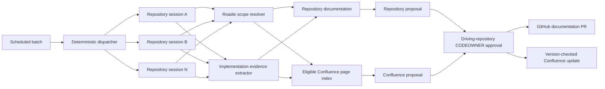
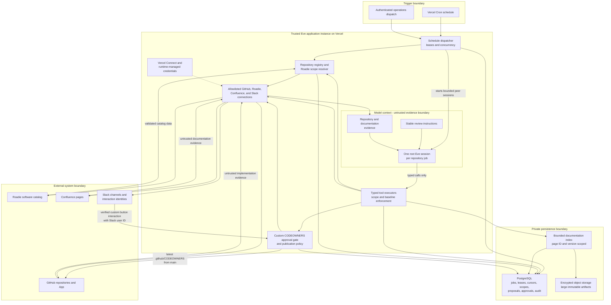
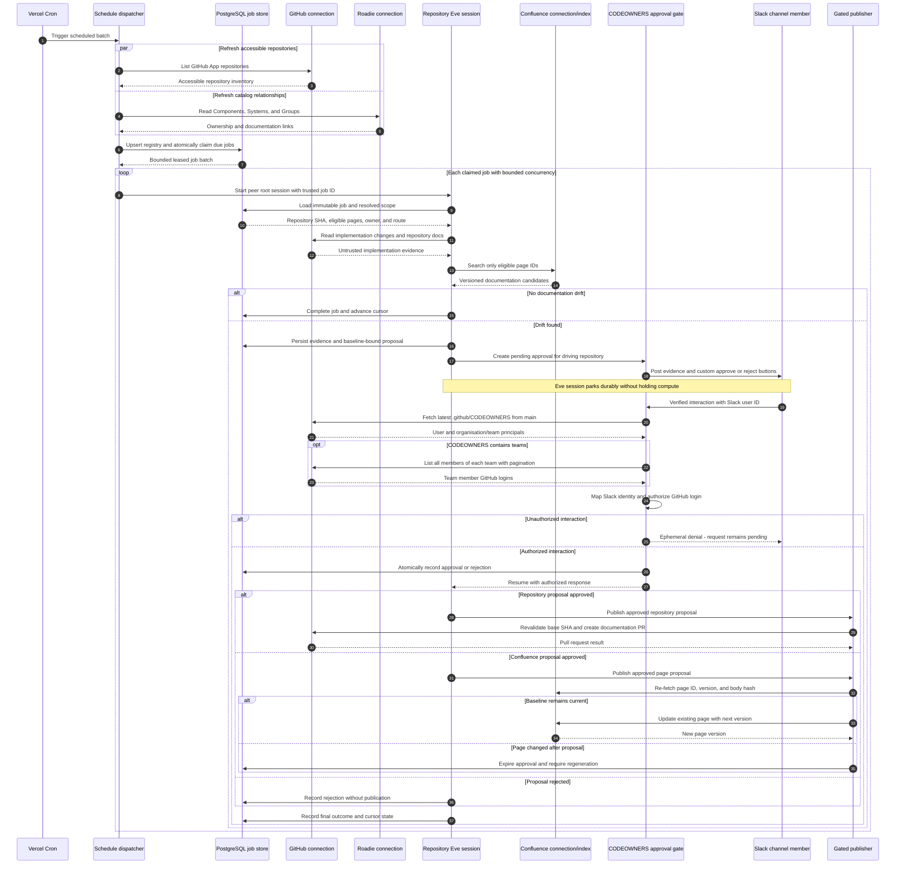

# Enterprise Documentation Drift System Plan

## Summary

Build the documentation drift system as a deterministic control plane around
isolated agent runs, rather than as one agent scanning every repository and
documentation page.

- Treat implementation as the source of truth.
- Use Roadie as the catalog for component, system, and owner identity.
- Declare eligible Confluence documentation through inherited Roadie links:
  `Component -> System -> Group`.
- Process repositories in scheduled incremental batches and run a periodic
  full reconciliation against the current implementation.
- Start one independent root Eve session per repository review. Do not use one
  parent agent to manage the enterprise repository queue.
- Allow repository documentation to produce approval-gated pull requests
  independently from Confluence updates.
- Require resolved routing, evidence, dedicated proposal verification,
  current-page revalidation, and approval by a current CODEOWNER of the
  repository driving each change.
- Store catalog state, indexes, cursors, proposals, and audit history in
  PostgreSQL. The model must not control routing, authorization, or publication
  decisions.



## System Architecture and Sequence

### Component and trust-boundary view



The model sees only the opaque job reference and evidence returned by typed
tools. Repository selection, credentials, resolved page IDs, approval
authorization, current baselines, and publication remain inside the trusted
runtime. External content is treated as untrusted even when it is fetched
through an authenticated connection.

### Scheduled repository review sequence



Each repository session is independently observable and retryable. A failure,
approval delay, or stale Confluence page affects only that job; the dispatcher
and other repository sessions continue independently.

## Architecture and Processing

### Scheduling and repository cursors

Replace time-window-only processing with a durable cursor per repository:

- A daily scheduled batch compares `lastSuccessfullyReviewedSha` with the
  current default-branch SHA.
- A weekly scheduled reconciliation compares the current implementation with
  all eligible documentation, including repositories without recent changes.
- A missing cursor, rewritten history, or default-branch change triggers a
  reconciliation rather than an inferred commit range.

Enumerate repositories from the GitHub App installation, then resolve each
repository's `roadie.yaml` and corresponding Roadie catalog entity. Run one
durable, isolated workflow for each `(repository, baseSha, headSha, mode)`.
Never place repositories or pages belonging to several teams into one model
context.

### Eve execution model

The scheduled batch must be orchestrated by application code, not by a parent
model. Each repository review is a peer root Eve session using the same agent
definition, with its own history, durable state, telemetry, failures, and
approval lifecycle.

The schedule handler performs the following deterministic sequence:

1. Refresh the materialized repository registry from the GitHub App inventory
   and Roadie catalog.
2. Atomically claim a bounded number of due review jobs using expiring leases.
3. Start one Eve session for each claimed job with `receive(...)`.
4. Run the claimed jobs concurrently with an explicit concurrency limit.
5. Mark successful jobs complete or release failed jobs for retry.
6. Leave repositories beyond the batch limit for a later schedule invocation.

Conceptually:

```ts
export default defineSchedule({
  cron: "0 7 * * 1-5",
  async run({ receive, waitUntil, appAuth }) {
    waitUntil(
      (async () => {
        await repositoryRegistry.refresh();

        const jobs = await reviewJobStore.claimDue({
          limit: 10,
          leaseForMs: 30 * 60_000,
        });

        await Promise.allSettled(
          jobs.map((job) =>
            receive(slack, {
              message: `Complete repository review job ${job.id}.`,
              target: { channelId: job.slackChannelId },
              auth: {
                ...appAuth,
                attributes: { reviewJobId: job.id },
              },
            }),
          ),
        );
      })(),
    );
  },
});
```

The production implementation should use a concurrency limiter rather than an
unbounded `Promise.allSettled`. The claim limit and concurrency limit are
separate controls: the first bounds leased work and the second protects model,
GitHub, Roadie, Confluence, database, and Slack rate limits.

The dispatcher must provide the job identity through trusted session context.
The model receives only an opaque job ID. An application-owned tool resolves
that ID from the authenticated session and rejects attempts to select a
different job.

Delivery is at least once. Review execution and publication must therefore be
idempotent by review job ID, repository SHA, and proposal baseline. A later
schedule invocation may reclaim an expired lease without producing duplicate
pull requests or Confluence updates.

A batch summary should be generated from persisted job outcomes by a separate
summary schedule or completion process. A parent agent must not retain all
repository results in its context while waiting for the batch.

### Repository registry

The set of repositories must not be embedded in agent instructions. It is
derived from three layers:

1. The GitHub App installation inventory defines the hard access boundary.
2. Roadie supplies Component, System, Group, documentation scope, ownership,
   Slack routing, and lifecycle metadata. It does not grant approval authority.
3. PostgreSQL stores the materialized scheduling state needed to process that
   inventory reliably.

The effective scheduled set contains repositories that are accessible to the
GitHub App, are not archived or administratively paused, and are due for
review. Missing Roadie ownership does not remove an accessible repository from
the set; it places that repository in `repo-only` mode and generates an
onboarding diagnostic.

```ts
interface RepositoryRegistryEntry {
  repositoryId: string;
  repositoryFullName: string;
  defaultBranch: string;
  isArchived: boolean;

  componentRef: string | null;
  systemRef: string | null;
  ownerRef: string | null;

  mode: "enabled" | "shadow" | "repo-only" | "paused";
  nextReviewAt: string;
  lastSuccessfullyReviewedSha: string | null;

  catalogRevision: string | null;
  configurationHash: string | null;
}
```

The registry is an operational projection, not a second ownership or
documentation configuration source. Component relationships and documentation
links remain in version-controlled Roadie entities. The database stores their
resolved references and hashes so each review can be reproduced and audited.

### Eve instructions and tools

The root instructions describe stable behavior and the structured workflow for
one repository review. They do not describe the multi-repository scheduler.
Use static Markdown unless the prompt genuinely needs build-time TypeScript or
runtime session-specific composition.

Recommended layout:

```text
agent/
  instructions.md
  instructions/
    10-review-procedure.md
    20-evidence-policy.md
    30-publication-policy.md
  lib/
    approval-request-store.ts
    codeowners-authorizer.ts
    repository-registry.ts
    review-job-store.ts
    documentation-scope-resolver.ts
    document-index.ts
    identity-link-store.ts
    slack-approval-actions.ts
  tools/
    request-change-approval.ts
    publish-repository-proposal.ts
    publish-confluence-proposal.ts
  schedules/
    dispatch-reviews.ts
    reconcile-documentation.ts
    summarize-reviews.ts
```

Instructions cover:

- implementation as the source of truth;
- the single-repository review procedure;
- untrusted repository and documentation content;
- scope and evidence requirements;
- when uncertainty requires a report instead of a proposal; and
- narrow patch and publication rules.

Deterministic application code covers:

- repository discovery and eligibility;
- cursors, job leases, retries, and concurrency;
- owner and page resolution;
- page-ID and baseline validation;
- approval authorization; and
- idempotent publication.

Prefer a small number of coarse, typed, application-owned tools over many
thin tools. Expected authored tools include:

- `load_review_job`: return the immutable job and resolved documentation scope
  derived from the current session.
- `search_document_index`: search only the job's eligible Confluence pages.
- `get_document_candidate`: load a shortlisted page and exact version.
- `record_drift_evidence`: persist structured claims and implementation
  references.
- `create_change_proposal`: persist a repository or Confluence proposal
  against an immutable baseline.
- `request_change_approval`: create an application-owned approval request for
  the repository driving the proposal and park the session.
- `publish_repository_proposal`: revalidate the approval and repository
  baseline, then create the documentation branch and pull request.
- `complete_review_job`: record the outcome and advance the repository cursor.
- `publish_confluence_proposal`: revalidate and publish an approved proposal.

GitHub, Roadie, and Confluence API operations should use narrowly allowlisted
MCP or OpenAPI connections where suitable. Scheduling stores, cursor logic,
scope resolution, indexing, and concurrency remain imported `lib/` code rather
than model-visible tools. Model-visible connections are read-only; only the
application-owned publication tools hold write capability, so the custom gate
cannot be bypassed with a lower-level GitHub or Confluence call.

### Review execution without subagents

The initial design has no declared subagents. Separate root sessions already
provide repository isolation and allow independent retries, approvals, and
observability. Each repository session completes the full review using the
root instructions and its bounded tool surface.

Proposal verification is a dedicated structured step in the same repository
session, followed by deterministic target, scope, and baseline checks in
application code. The stages remain ordered:

```text
extract implementation evidence
    -> rank eligible documentation
    -> draft proposal
    -> verify proposal
    -> request approval
```

Do not use the built-in `agent` tool or Eve's experimental model-authored
`Workflow` tool for repository review or enterprise fan-out. Queue selection,
concurrency, retries, verification gates, and authorization are operational
controls and remain deterministic TypeScript.

### CODEOWNERS approval authorization

Every repository and Confluence proposal is authorized by the repository
whose implementation evidence caused the proposed change. A Confluence page
does not need an approval repository of its own, and joint page ownership does
not add approvers from other repositories.

The authorization service must:

1. Bind the approval request to the driving repository, proposal digest,
   target, Slack channel, Slack thread and message, expiry, and parked-session
   continuation reference.
2. Post custom Slack actions rather than Eve's built-in `eve_input:` approval
   actions. Built-in actions resume the pending input before application code
   can authorize the clicking user.
3. Receive a verified Slack interaction, require an opaque single-purpose
   request ID, verify its channel, thread, message, status, and expiry, and use
   the interaction's Slack user ID. Never trust identity or scope supplied in
   button values or model output.
4. Resolve that Slack ID to a verified GitHub login through an
   application-owned identity mapping populated by an enterprise identity
   sync or controlled administration. A uniquely verified corporate email may
   establish or refresh a link; display names and ambiguous emails cannot.
5. Fetch `.github/CODEOWNERS` from the latest commit on `main` when the button
   is clicked. Do not authorize from the review SHA, a Roadie User resource, a
   cached membership result, or `memberOf`.
6. Parse individual `@user` principals and `@organisation/team` principals
   separately. Individual users enter the approver set directly. For each team,
   require the organisation to match the driving repository, then use the
   GitHub App to fetch every page of current team members and add their GitHub
   logins to the approver set. Changed documentation or implementation paths do
   not select different owners.
7. Allow either approval or rejection only when the resolved GitHub login is
   in that set. An unauthorized click returns an ephemeral denial and leaves
   the request pending.
8. Atomically accept the first authorized terminal decision, retain subsequent
   interactions for audit, and resume Eve only after the decision is stored.

The GitHub App needs read access to repository contents and organization team
membership. Failure to read or parse CODEOWNERS, expand a team, or resolve the
Slack identity blocks both repository and Confluence publication. Team-member
results may be reused within one authorization evaluation but are not persisted
as an independent source of authority.

Approval requests use a small explicit state machine:

```text
pending -> approved -> published
pending -> rejected
pending | approved -> expired
```

Unauthorized and replayed interactions are audited but do not change state.
Publication accepts only an unexpired `approved` request whose proposal digest
and target baseline still match. The CODEOWNERS authorization recorded when
the decision was accepted remains valid for that request's lifecycle.

### Implementation evidence

Extract implementation facts before asking a model to assess drift. Relevant
signals include:

- public APIs and schemas;
- commands, configuration, and environment variables;
- externally observable behavior;
- integrations and service dependencies;
- operational contracts and failure behavior; and
- tests that demonstrate supported behavior.

Every proposed documentation change must reference evidence at the reviewed
commit SHA. The system should distinguish facts visible in implementation from
intent, policy, historical context, or operational knowledge that cannot be
derived from code. It must not rewrite the latter without evidence.

### Documentation retrieval

Use hybrid lexical and semantic retrieval only to rank pages inside the
deterministically authorized Confluence set. Retrieval must never expand the
allowed page set.

Maintain an incrementally refreshed page index so a repository run does not
load every inherited page into the model. Fetch live Confluence content only
for shortlisted pages. Store one normalized index per immutable
`{siteId, pageId, version}` instead of copying page content for every related
component.

Treat repository and Confluence content as untrusted evidence. The model must
not be able to supply repository IDs, page IDs, ownership identities, or
approval routes directly to executors.

## Roadie Configuration and Resolution

Use standard `metadata.links` on Group, System, and Component entities. Link
`type` is adopter-defined, while annotations use an organization-owned domain
prefix.

```yaml
apiVersion: backstage.io/v1alpha1
kind: Group
metadata:
  name: example-team
  annotations:
    docs.example.com/slack-channel-id: C0123456789
    docs.example.com/confluence-exclude-page-ids: "12345,67890"
  links:
    - title: Example engineering handbook
      url: https://example.atlassian.net/wiki/spaces/EXAMPLE/pages/11111
      type: documentation-confluence-page
    - title: Example service documentation
      url: https://example.atlassian.net/wiki/spaces/EXAMPLE/pages/22222
      type: documentation-confluence-root
spec:
  type: team
```

Apply the same link types at different scopes:

- `Group` links apply to team-wide documentation.
- `System` links apply to documentation shared by services in that system.
- `Component` links apply only to that component or repository.

A root link includes its Confluence page descendants. Explicit exclusions
apply only to roots declared on the same entity.

### Resolution rules

1. Resolve the component's full Roadie entity reference.
2. Follow its `spec.system` and `spec.owner` relationships.
3. Union Component, System, and Group documentation links.
4. Expand explicit roots and apply their local exclusions.
5. Canonicalize and de-duplicate by `{Confluence site ID, page ID}`, never by
   mutable URL.
6. Retain every link's provenance for routing, diagnostics, and audit.

Child entities cannot remove inherited team or system pages. Exclusions remain
controlled by the entity that declares the root.

Duplicate links associated with one owner produce a catalog warning but remain
usable. A page associated with different owner Groups remains eligible for
detection and update: the driving repository determines approval authority,
while that repository's resolved Roadie owner determines the Slack route.

If the component, owner, or system cannot be resolved:

- repository-local drift detection remains permitted;
- all repository and Confluence publication is blocked because the configured
  Slack route cannot be established; and
- an onboarding diagnostic is sent to a central operations channel.

Validate the configuration in CI, including:

- approved Confluence hosts and valid page IDs;
- canonical Slack channel IDs;
- valid Roadie entity references;
- bounded root expansion;
- reachable pages; and
- conflicting ownership declarations.

## Contracts and Storage

Define and validate the following typed boundaries:

- `ResolvedDocumentationScope`: repository, Component/System/Group references,
  configuration revision, Slack route, exact/root provenance, allowed page
  IDs, and Confluence eligibility.
- `ReviewJob`: repository, base and head SHA, incremental or reconciliation
  mode, and catalog snapshot.
- `EvidenceClaim`: factual claim, implementation references at the reviewed
  SHA, documentation location and version, and confidence reasons.
- `ChangeProposal`: one repository file or Confluence page, immutable baseline,
  structured patch, evidence bundle, approval state, and publication result.
- `ApprovalRequest`: proposal digest, driving repository, target, Slack route,
  parked-session reference, status, expiry, and authorized decision.
- `IdentityLink`: Slack user ID, verified GitHub login, verification source,
  and refresh timestamp.

Use PostgreSQL as the authoritative application store, optionally with
`pgvector` for candidate ranking. Store:

- catalog snapshots and resolved entity relationships;
- repository cursors and scheduled-job leases;
- Confluence page identity, hierarchy, version, body hash, permissions, and
  indexed sections;
- evidence claims, proposals, approval requests, identity links, conflicts,
  and publication outcomes;
  and
- immutable audit records connecting source SHA, current CODEOWNERS blob SHA,
  the matched user or team principal, resolved GitHub login, Slack actor,
  catalog revision, page version, decision, and resulting pull request or page
  version.

Object storage may hold encrypted large before-and-after artifacts under a
defined retention policy. Cached content and embeddings are retrieval aids,
not sources of truth.

## Safety and Publication

Publication must use invariant-based gates rather than relying on a model's
numeric confidence score:

1. The target is explicitly present in the resolved scope.
2. The driving repository and its Roadie-configured Slack route are resolved.
3. Every changed factual statement has implementation evidence at the reviewed
   SHA.
4. The patch is narrow and does not invent intent, policy, or architecture.
5. A dedicated verification step confirms the proposal and preservation of
   unaffected content, followed by deterministic scope and baseline checks.
6. A Slack user mapped to a current CODEOWNER of the driving repository
   approves in the configured Slack channel through the custom approval gate.
7. The executor re-fetches the target and confirms that its baseline has not
   changed.

### Repository publication

- Create one branch and pull request per repository review.
- Re-read the default branch before publication and invalidate stale
  proposals.
- Use conventional commits and the target team's branch policy.
- Never write directly to the default branch.

### Confluence publication

- Preserve the native Confluence representation and structured nodes or
  macros. Do not round-trip an entire page through Markdown.
- Show a section-level before-and-after diff and evidence links in Slack.
- On approval, re-fetch the page and compare its page ID, version, and body
  hash with the proposal baseline.
- If the page changed, expire the approval and regenerate the proposal instead
  of merging against newer content.
- Update only the existing page body, using the next version and an audit
  message containing the review ID and source SHA.
- Do not expose create, delete, move, permission, or space-management
  operations to the agent.
- Serialize proposals by page ID so simultaneous repository runs cannot
  overwrite each other.

## Verification and Rollout

### Tests

- Contract tests for inheritance, root expansion, exclusions, de-duplication,
  ambiguous ownership, missing Roadie metadata, and per-team Slack routing.
- Integration tests for paginated GitHub history, missed schedules, rewritten
  history, Confluence descendants, restricted pages, version conflicts,
  approval expiry, and concurrent proposals.
- Security tests proving model-supplied identifiers cannot escape the resolved
  scope, prompt-injected content cannot invoke writes, built-in Eve approval
  actions cannot bypass the gate, and unauthorized Slack principals cannot
  approve or reject.
- Authorization tests for Slack-to-GitHub identity mapping, individual owners,
  paginated GitHub team expansion, concurrent clicks, missing or malformed
  CODEOWNERS, and fail-closed dependency errors.
- Golden drift evaluations covering known drift, valid no-drift, shared pages,
  macros, tables, code blocks, and changes that must remain report-only.

Acceptance requires zero writes outside resolved scope, zero stale-version
overwrites, complete publication audit trails, and measured precision reviewed
by pilot teams.

### Rollout

1. Pilot one example team in shadow mode. Build the Roadie resolver, page
   index, durable cursors, and precision baseline.
2. Enable approval-gated repository pull requests while keeping Confluence
   suggestion-only.
3. Enable version-checked Confluence updates for exact page links.
4. Enable bounded root expansion, then onboard additional teams through
   Roadie pull requests.
5. Keep all writes approval-gated. Selective automatic publication is outside
   the initial scope.

## Assumptions

- Group and System entities are maintained in a central Roadie configuration
  repository.
- Roadie's catalog API is a runtime directory and cache; version-controlled
  entity YAML remains the configuration source.
- Scheduled batches, rather than merge events, are the primary trigger.
- Review and approval are routed to a canonical Slack channel configured on
  each owning Group.
- Approval authority always comes from the latest `.github/CODEOWNERS` on
  `main` in the repository driving the change. CODEOWNERS are treated as
  repository-wide, and Roadie `User` resources and `memberOf` are not approval
  fallbacks.
- Missing Roadie ownership permits repository-only detection but blocks
  publication until the Slack route is resolved.
- Exact Confluence links and bounded page-tree roots are supported; whole-space
  discovery is not.
- All repository and Confluence publications require human approval.

## References

- [Roadie: Modeling entities in the catalog](https://roadie.io/docs/catalog/modeling-entities/)
- [Backstage: Descriptor format](https://backstage.io/docs/features/software-catalog/descriptor-format/)
- [Backstage: Entity references](https://backstage.io/docs/features/software-catalog/references/)
- [Confluence Cloud REST API: Pages](https://developer.atlassian.com/cloud/confluence/rest/v2/api-group-page/)
- [Confluence Cloud REST API: Descendants](https://developer.atlassian.com/cloud/confluence/rest/v2/api-group-descendants/)
