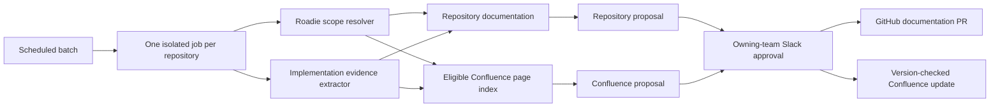

# Enterprise Documentation Drift System Plan

## Summary

Build the documentation drift system as a deterministic control plane around
isolated agent runs, rather than as one agent scanning every repository and
documentation page.

- Treat implementation as the source of truth.
- Use Roadie as the catalog for component, system, and owner identity.
- Declare eligible Confluence documentation through inherited Roadie links:
  `Component -> System -> Group`.
- Process repositories in scheduled incremental batches and run a periodic
  full reconciliation against the current implementation.
- Allow repository documentation to produce approval-gated pull requests
  independently from Confluence updates.
- Require resolved ownership, evidence, independent verification, current-page
  revalidation, and authorized Slack approval for Confluence changes.
- Store catalog state, indexes, cursors, proposals, and audit history in
  PostgreSQL. The model must not control routing, authorization, or publication
  decisions.



## Architecture and Processing

### Scheduling and repository cursors

Replace time-window-only processing with a durable cursor per repository:

- A daily scheduled batch compares `lastSuccessfullyReviewedSha` with the
  current default-branch SHA.
- A weekly scheduled reconciliation compares the current implementation with
  all eligible documentation, including repositories without recent changes.
- A missing cursor, rewritten history, or default-branch change triggers a
  reconciliation rather than an inferred commit range.

Enumerate repositories from the GitHub App installation, then resolve each
repository's `roadie.yaml` and corresponding Roadie catalog entity. Run one
durable, isolated workflow for each `(repository, baseSha, headSha, mode)`.
Never place repositories or pages belonging to several teams into one model
context.

### Implementation evidence

Extract implementation facts before asking a model to assess drift. Relevant
signals include:

- public APIs and schemas;
- commands, configuration, and environment variables;
- externally observable behavior;
- integrations and service dependencies;
- operational contracts and failure behavior; and
- tests that demonstrate supported behavior.

Every proposed documentation change must reference evidence at the reviewed
commit SHA. The system should distinguish facts visible in implementation from
intent, policy, historical context, or operational knowledge that cannot be
derived from code. It must not rewrite the latter without evidence.

### Documentation retrieval

Use hybrid lexical and semantic retrieval only to rank pages inside the
deterministically authorized Confluence set. Retrieval must never expand the
allowed page set.

Maintain an incrementally refreshed page index so a repository run does not
load every inherited page into the model. Fetch live Confluence content only
for shortlisted pages. Store one normalized index per immutable
`{siteId, pageId, version}` instead of copying page content for every related
component.

Treat repository and Confluence content as untrusted evidence. The model must
not be able to supply repository IDs, page IDs, ownership identities, or
approval routes directly to executors.

## Roadie Configuration and Resolution

Use standard `metadata.links` on Group, System, and Component entities. Link
`type` is adopter-defined, while annotations use an organization-owned domain
prefix.

```yaml
apiVersion: backstage.io/v1alpha1
kind: Group
metadata:
  name: example-team
  annotations:
    docs.example.com/slack-channel-id: C0123456789
    docs.example.com/confluence-exclude-page-ids: "12345,67890"
  links:
    - title: Example engineering handbook
      url: https://example.atlassian.net/wiki/spaces/EXAMPLE/pages/11111
      type: documentation-confluence-page
    - title: Example service documentation
      url: https://example.atlassian.net/wiki/spaces/EXAMPLE/pages/22222
      type: documentation-confluence-root
spec:
  type: team
```

Apply the same link types at different scopes:

- `Group` links apply to team-wide documentation.
- `System` links apply to documentation shared by services in that system.
- `Component` links apply only to that component or repository.

A root link includes its Confluence page descendants. Explicit exclusions
apply only to roots declared on the same entity.

### Resolution rules

1. Resolve the component's full Roadie entity reference.
2. Follow its `spec.system` and `spec.owner` relationships.
3. Union Component, System, and Group documentation links.
4. Expand explicit roots and apply their local exclusions.
5. Canonicalize and de-duplicate by `{Confluence site ID, page ID}`, never by
   mutable URL.
6. Retain every link's provenance for routing, diagnostics, and audit.

Child entities cannot remove inherited team or system pages. Exclusions remain
controlled by the entity that declares the root.

Duplicate links associated with one owner produce a catalog warning but remain
usable. A page associated with different owner Groups remains eligible for
detection but is ineligible for updates until its ownership is unambiguous.

If the component, owner, or system cannot be resolved:

- repository-local drift detection and an approval-gated pull request remain
  permitted;
- all Confluence proposals and updates are blocked; and
- an onboarding diagnostic is sent to a central operations channel.

Validate the configuration in CI, including:

- approved Confluence hosts and valid page IDs;
- canonical Slack channel IDs;
- valid Roadie entity references;
- bounded root expansion;
- reachable pages; and
- conflicting ownership declarations.

## Contracts and Storage

Define and validate the following typed boundaries:

- `ResolvedDocumentationScope`: repository, Component/System/Group references,
  configuration revision, Slack route, exact/root provenance, allowed page
  IDs, and Confluence eligibility.
- `ReviewJob`: repository, base and head SHA, incremental or reconciliation
  mode, and catalog snapshot.
- `EvidenceClaim`: factual claim, implementation references at the reviewed
  SHA, documentation location and version, and confidence reasons.
- `ChangeProposal`: one repository file or Confluence page, immutable baseline,
  structured patch, evidence bundle, approval state, and publication result.

Use PostgreSQL as the authoritative application store, optionally with
`pgvector` for candidate ranking. Store:

- catalog snapshots and resolved entity relationships;
- repository cursors and scheduled-job leases;
- Confluence page identity, hierarchy, version, body hash, permissions, and
  indexed sections;
- evidence claims, proposals, approvals, conflicts, and publication outcomes;
  and
- immutable audit records connecting source SHA, catalog revision, page
  version, approver, and resulting pull request or page version.

Object storage may hold encrypted large before-and-after artifacts under a
defined retention policy. Cached content and embeddings are retrieval aids,
not sources of truth.

## Safety and Publication

Publication must use invariant-based gates rather than relying on a model's
numeric confidence score:

1. The target is explicitly present in the resolved scope.
2. Confluence ownership and Slack routing are unambiguous.
3. Every changed factual statement has implementation evidence at the reviewed
   SHA.
4. The patch is narrow and does not invent intent, policy, or architecture.
5. An independent verifier confirms the proposal and preservation of
   unaffected content.
6. An authorized member of the owning Roadie Group approves in the configured
   Slack channel.
7. The executor re-fetches the target and confirms that its baseline has not
   changed.

### Repository publication

- Create one branch and pull request per repository review.
- Re-read the default branch before publication and invalidate stale
  proposals.
- Use conventional commits and the target team's branch policy.
- Never write directly to the default branch.

### Confluence publication

- Preserve the native Confluence representation and structured nodes or
  macros. Do not round-trip an entire page through Markdown.
- Show a section-level before-and-after diff and evidence links in Slack.
- On approval, re-fetch the page and compare its page ID, version, and body
  hash with the proposal baseline.
- If the page changed, expire the approval and regenerate the proposal instead
  of merging against newer content.
- Update only the existing page body, using the next version and an audit
  message containing the review ID and source SHA.
- Do not expose create, delete, move, permission, or space-management
  operations to the agent.
- Serialize proposals by page ID so simultaneous repository runs cannot
  overwrite each other.

## Verification and Rollout

### Tests

- Contract tests for inheritance, root expansion, exclusions, de-duplication,
  ambiguous ownership, missing Roadie metadata, and per-team Slack routing.
- Integration tests for paginated GitHub history, missed schedules, rewritten
  history, Confluence descendants, restricted pages, version conflicts,
  approval expiry, and concurrent proposals.
- Security tests proving model-supplied identifiers cannot escape the resolved
  scope, prompt-injected content cannot invoke writes, and unauthorized Slack
  principals cannot approve.
- Golden drift evaluations covering known drift, valid no-drift, shared pages,
  macros, tables, code blocks, and changes that must remain report-only.

Acceptance requires zero writes outside resolved scope, zero stale-version
overwrites, complete publication audit trails, and measured precision reviewed
by pilot teams.

### Rollout

1. Pilot one example team in shadow mode. Build the Roadie resolver, page
   index, durable cursors, and precision baseline.
2. Enable approval-gated repository pull requests while keeping Confluence
   suggestion-only.
3. Enable version-checked Confluence updates for exact page links.
4. Enable bounded root expansion, then onboard additional teams through
   Roadie pull requests.
5. Keep all writes approval-gated. Selective automatic publication is outside
   the initial scope.

## Assumptions

- Group and System entities are maintained in a central Roadie configuration
  repository.
- Roadie's catalog API is a runtime directory and cache; version-controlled
  entity YAML remains the configuration source.
- Scheduled batches, rather than merge events, are the primary trigger.
- Review and approval are routed to a canonical Slack channel configured on
  each owning Group.
- Repository documentation may be updated when Roadie ownership is unresolved,
  but Confluence access remains blocked.
- Exact Confluence links and bounded page-tree roots are supported; whole-space
  discovery is not.
- All repository and Confluence publications require human approval.

## References

- [Roadie: Modeling entities in the catalog](https://roadie.io/docs/catalog/modeling-entities/)
- [Backstage: Descriptor format](https://backstage.io/docs/features/software-catalog/descriptor-format/)
- [Backstage: Entity references](https://backstage.io/docs/features/software-catalog/references/)
- [Confluence Cloud REST API: Pages](https://developer.atlassian.com/cloud/confluence/rest/v2/api-group-page/)
- [Confluence Cloud REST API: Descendants](https://developer.atlassian.com/cloud/confluence/rest/v2/api-group-descendants/)
