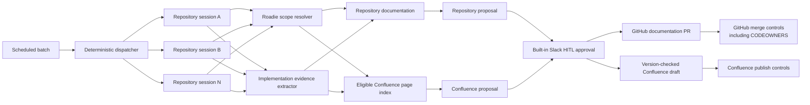
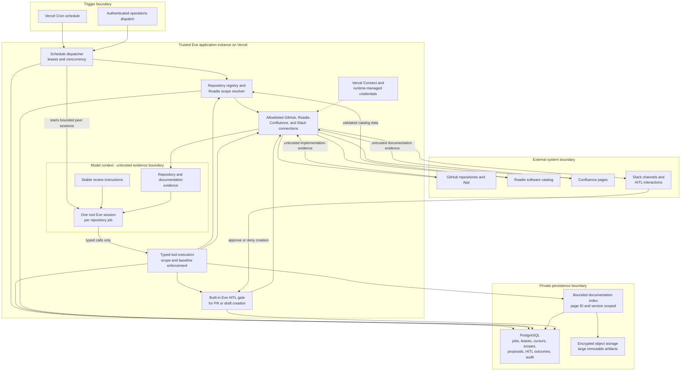
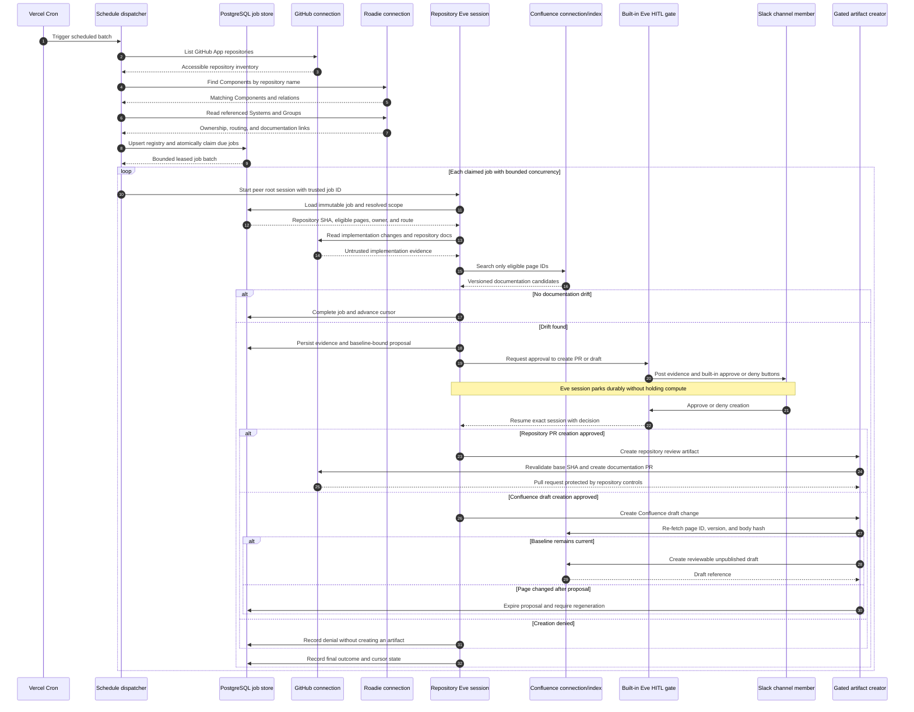

# Enterprise Documentation Drift System Plan

Implementation sequencing and pull-request boundaries are defined in
[`implementation-plan.md`](./implementation-plan.md).

## Summary

Build the documentation drift system as a deterministic control plane around
isolated agent runs, rather than as one agent scanning every repository and
documentation page.

- Treat implementation as the source of truth.
- Use Roadie as the catalog for component, system, and owner identity.
- Declare eligible Confluence documentation through inherited Roadie links:
  `Component -> System -> Group`.
- Process repositories in scheduled incremental batches and run a periodic
  full reconciliation against the current implementation.
- Start one independent root Eve session per repository review. Do not use one
  parent agent to manage the enterprise repository queue.
- Allow repository documentation to produce approval-gated pull requests
  independently from Confluence updates.
- Require resolved routing, evidence, dedicated proposal verification,
  current-target revalidation, and built-in human approval before creating a
  pull request or Confluence draft change.
- Treat HITL as a volume and runaway-action control, not as merge or publish
  authorization. GitHub and Confluence enforce those permissions.
- Store catalog state, indexes, cursors, proposals, and audit history in
  PostgreSQL. The model must not control routing, target scope, or write
  execution.


```mermaid
flowchart LR
    S["Scheduled batch"] --> D["Deterministic dispatcher"]
    D --> J1["Repository session A"]
    D --> J2["Repository session B"]
    D --> JN["Repository session N"]

    J1 --> R["Roadie scope resolver"]
    J2 --> R
    JN --> R
    J1 --> I["Implementation evidence extractor"]
    J2 --> I
    JN --> I

    R --> RD["Repository documentation"]
    R --> CI["Eligible Confluence page index"]

    I --> RD
    I --> CI

    RD --> P1["Repository proposal"]
    CI --> P2["Confluence proposal"]

    P1 --> A["Built-in Slack HITL approval"]
    P2 --> A

    A --> G["GitHub documentation PR"]
    A --> C["Version-checked Confluence draft"]

    G --> GM["GitHub merge controls<br/>including CODEOWNERS"]
    C --> CP["Confluence publish controls"]
```

## System Architecture and Sequence

### Component and trust-boundary view


```mermaid
flowchart TB
    subgraph Triggers["Trigger boundary"]
        Cron["Vercel Cron schedule"]
        Ops["Authenticated operations dispatch"]
    end

    subgraph Runtime["Trusted Eve application instance on Vercel"]
        Dispatcher["Schedule dispatcher<br/>leases and concurrency"]
        Registry["Repository registry and<br/>Roadie scope resolver"]
        Tools["Typed tool executors<br/>scope and baseline enforcement"]
        Approval["Built-in Eve HITL gate<br/>for PR or draft creation"]
        Connections["Allowlisted GitHub, Roadie,<br/>Confluence, and Slack connections"]
        Credentials["Vercel Connect and<br/>runtime-managed credentials"]

        subgraph ModelBoundary["Model context - untrusted evidence boundary"]
            Session["One root Eve session<br/>per repository job"]
            Instructions["Stable review instructions"]
            Evidence["Repository and documentation<br/>evidence"]
        end
    end

    subgraph DataBoundary["Private persistence boundary"]
        Postgres["PostgreSQL<br/>jobs, leases, cursors, scopes,<br/>proposals, HITL outcomes, audit"]
        Objects["Encrypted object storage<br/>large immutable artifacts"]
        Index["Bounded documentation index<br/>page ID and version scoped"]
    end

    subgraph External["External system boundary"]
        GitHub["GitHub repositories and App"]
        Roadie["Roadie software catalog"]
        Confluence["Confluence pages"]
        Slack["Slack channels and<br/>HITL interactions"]
    end

    Cron --> Dispatcher
    Ops --> Dispatcher
    Dispatcher --> Registry
    Dispatcher --> Postgres
    Dispatcher -->|"starts bounded peer sessions"| Session

    Instructions --> Session
    Session -->|"typed calls only"| Tools
    Tools --> Registry
    Tools --> Postgres
    Tools --> Index
    Tools --> Approval
    Tools --> Connections

    Registry --> Postgres
    Registry --> Connections
    Index --> Postgres
    Index --> Objects
    Approval --> Postgres
    Approval --> Connections

    Credentials -.-> Connections
    Connections --> GitHub
    Connections --> Roadie
    Connections --> Confluence
    Connections --> Slack

    GitHub -->|"untrusted implementation evidence"| Connections
    Roadie -->|"validated catalog data"| Registry
    Confluence -->|"untrusted documentation evidence"| Connections
    Connections --> Evidence
    Evidence --> Session
    Slack -->|"approve or deny creation"| Approval
```

The model sees only the opaque job reference and evidence returned by typed
tools. Repository selection, credentials, resolved page IDs, current baselines,
and write execution remain inside the trusted runtime. External content is
treated as untrusted even when it is fetched through an authenticated
connection.

The HITL interaction authorizes only creation of a review artifact. Any member
of the configured Slack channel may approve or deny that action. GitHub
repository permissions, rulesets, and CODEOWNERS govern merge; Confluence tool
credentials and page or space permissions govern publication. The agent does
not receive merge or publish capability.

### Scheduled repository review sequence


```mermaid
sequenceDiagram
    autonumber
    participant Cron as Vercel Cron
    participant Dispatcher as Schedule dispatcher
    participant Store as PostgreSQL job store
    participant GitHub as GitHub connection
    participant Roadie as Roadie connection
    participant Session as Repository Eve session
    participant Confluence as Confluence connection/index
    participant Gate as Built-in Eve HITL gate
    participant Slack as Slack channel member
    participant Creator as Gated artifact creator

    Cron->>Dispatcher: Trigger scheduled batch
    Dispatcher->>GitHub: List GitHub App repositories
    GitHub-->>Dispatcher: Accessible repository inventory
    Dispatcher->>Roadie: Find Components by repository name
    Roadie-->>Dispatcher: Matching Components and relations
    Dispatcher->>Roadie: Read referenced Systems and Groups
    Roadie-->>Dispatcher: Ownership, routing, and documentation links
    Dispatcher->>Store: Upsert registry and atomically claim due jobs
    Store-->>Dispatcher: Bounded leased job batch

    loop Each claimed job with bounded concurrency
        Dispatcher->>Session: Start peer root session with trusted job ID
        Session->>Store: Load immutable job and resolved scope
        Store-->>Session: Repository SHA, eligible pages, owner, and route
        Session->>GitHub: Read implementation changes and repository docs
        GitHub-->>Session: Untrusted implementation evidence
        Session->>Confluence: Search only eligible page IDs
        Confluence-->>Session: Versioned documentation candidates

        alt No documentation drift
            Session->>Store: Complete job and advance cursor
        else Drift found
            Session->>Store: Persist evidence and baseline-bound proposal
            Session->>Gate: Request approval to create PR or draft
            Gate->>Slack: Post evidence and built-in approve or deny buttons
            Note over Session,Slack: Eve session parks durably without holding compute
            Slack->>Gate: Approve or deny creation
            Gate-->>Session: Resume exact session with decision

            alt Repository PR creation approved
                Session->>Creator: Create repository review artifact
                Creator->>GitHub: Revalidate base SHA and create documentation PR
                GitHub-->>Creator: Pull request protected by repository controls
            else Confluence draft creation approved
                Session->>Creator: Create Confluence draft change
                Creator->>Confluence: Re-fetch page ID, version, and body hash
                alt Baseline remains current
                    Creator->>Confluence: Create reviewable unpublished draft
                    Confluence-->>Creator: Draft reference
                else Page changed after proposal
                    Creator->>Store: Expire proposal and require regeneration
                end
            else Creation denied
                Session->>Store: Record denial without creating an artifact
            end

            Session->>Store: Record final outcome and cursor state
        end
    end
```

Each repository session is independently observable and retryable. A failure,
approval delay, or stale Confluence page affects only that job; the dispatcher
and other repository sessions continue independently.

## Architecture and Processing

### Scheduling and repository cursors

Replace time-window-only processing with a durable cursor per repository:

- A daily scheduled batch compares `lastSuccessfullyReviewedSha` with the
  current default-branch SHA.
- A weekly scheduled reconciliation compares the current implementation with
  all eligible documentation, including repositories without recent changes.
- A missing cursor, rewritten history, or default-branch change triggers a
  reconciliation rather than an inferred commit range.

Enumerate repositories from the GitHub App installation, then use each
repository name to query its Roadie Component through the catalog API. Validate
that the returned Component's `github.com/project-slug` annotation equals the
full GitHub repository name before using its relationships or documentation.
Run one durable, isolated workflow for each
`(repository, baseSha, headSha, mode)`. Never place repositories or pages
belonging to several teams into one model context.

### Eve execution model

The scheduled batch must be orchestrated by application code, not by a parent
model. Each repository review is a peer root Eve session using the same agent
definition, with its own history, durable state, telemetry, failures, and
approval lifecycle.

The schedule handler performs the following deterministic sequence:

1. Refresh the materialized repository registry from the GitHub App inventory
   and Roadie catalog.
2. Create one stable claim ID for the dispatcher invocation, then atomically
   claim a bounded number of due review jobs using expiring leases. Reuse that
   ID if the database call must be retried.
3. Start one Eve session for each claimed job with `receive(...)`.
4. Run the claimed jobs concurrently with an explicit concurrency limit.
5. Mark successful jobs complete or release failed jobs for retry.
6. Leave repositories beyond the batch limit for a later schedule invocation.

Conceptually:

```ts
export default defineSchedule({
  cron: "0 7 * * 1-5",
  async run({ receive, waitUntil, appAuth }) {
    waitUntil(
      (async () => {
        await repositoryRegistry.refresh();

        const claimId = crypto.randomUUID();
        const workerId = crypto.randomUUID();
        const jobs = await reviewJobStore.claimDue({
          claimId,
          workerId,
          limit: 10,
          leaseForMs: 30 * 60_000,
        });

        await Promise.allSettled(
          jobs.map((job) =>
            receive(slack, {
              message: `Complete repository review job ${job.id}.`,
              target: { channelId: job.slackChannelId },
              auth: {
                ...appAuth,
                attributes: { reviewJobId: job.id },
              },
            }),
          ),
        );
      })(),
    );
  },
});
```

The production implementation should use a concurrency limiter rather than an
unbounded `Promise.allSettled`. The claim limit and concurrency limit are
separate controls: the first bounds leased work and the second protects model,
GitHub, Roadie, Confluence, database, and Slack rate limits.

The caller must create the claim ID once and retain it across retries of that
claim operation. PostgreSQL persists the invocation even when it returns no
jobs. Reusing the ID replays only its jobs that remain leased; it never leases
another batch. Reuse with different worker, limit, or lease parameters fails.

The dispatcher must provide the job identity through trusted session context.
The model receives only an opaque job ID. An application-owned tool resolves
that ID from the authenticated session and rejects attempts to select a
different job.

Delivery is at least once. Review execution and artifact creation must
therefore be idempotent by review job ID, repository SHA, and proposal
baseline. A later schedule invocation may reclaim an expired lease without
producing duplicate pull requests or Confluence drafts.

A batch summary should be generated from persisted job outcomes by a separate
summary schedule or completion process. A parent agent must not retain all
repository results in its context while waiting for the batch.

### Repository registry

The set of repositories must not be embedded in agent instructions. It is
derived from three layers:

1. The GitHub App installation inventory defines the hard access boundary.
2. The Roadie catalog API supplies Component, System, Group, documentation
   scope, ownership, Slack routing, and lifecycle metadata. It does not grant
   merge or publish authority.
3. PostgreSQL stores the materialized scheduling state needed to process that
   inventory reliably.

The effective scheduled set contains repositories that are accessible to the
GitHub App, are not archived or administratively paused, and are due for
review. Missing Roadie ownership does not remove an accessible repository from
the set; it places that repository in `repo-only` mode and generates an
onboarding diagnostic.

```ts
interface RepositoryRegistryEntry {
  repositoryId: string;
  repositoryFullName: string;
  defaultBranch: string;
  defaultBranchHeadSha: string;
  isAccessible: boolean;
  isArchived: boolean;

  componentRef: string | null;
  systemRef: string | null;
  ownerRef: string | null;

  mode: "enabled" | "shadow" | "repo-only" | "paused";
  nextReviewAt: string;
  lastSuccessfullyReviewedSha: string | null;

  catalogRevision: string | null;
  configurationHash: string | null;
}
```

The registry is an operational projection, not a second ownership or
documentation configuration source. Component relationships and documentation
links remain in version-controlled Roadie entities. The database stores their
resolved references and hashes so each review can be reproduced and audited.
Runtime resolution never depends on reading catalog YAML from the target
repository; Component entities may be maintained centrally or alongside their
source code.

### Eve instructions and tools

The root instructions describe stable behavior and the structured workflow for
one repository review. They do not describe the multi-repository scheduler.
Use static Markdown unless the prompt genuinely needs build-time TypeScript or
runtime session-specific composition.

Recommended layout:

```text
agent/
  instructions.md
  instructions/
    10-review-procedure.md
    20-evidence-policy.md
    30-artifact-creation-policy.md
  lib/
    repository-registry.ts
    review-job-store.ts
    documentation-scope-resolver.ts
    document-index.ts
  tools/
    create-repository-pull-request.ts
    create-confluence-draft.ts
  schedules/
    dispatch-reviews.ts
    reconcile-documentation.ts
    summarize-reviews.ts
```

Instructions cover:

- implementation as the source of truth;
- the single-repository review procedure;
- untrusted repository and documentation content;
- scope and evidence requirements;
- when uncertainty requires a report instead of a proposal; and
- narrow patch and artifact-creation rules.

Deterministic application code covers:

- repository discovery and eligibility;
- cursors, job leases, retries, and concurrency;
- owner and page resolution;
- page-ID and baseline validation;
- HITL policy configuration; and
- idempotent review-artifact creation.

Prefer a small number of coarse, typed, application-owned tools over many
thin tools. Expected authored tools include:

- `load_review_job`: return the immutable job and resolved documentation scope
  derived from the current session.
- `search_document_index`: search only the job's eligible Confluence pages.
- `get_document_candidate`: load a shortlisted page and exact version.
- `record_drift_evidence`: persist structured claims and implementation
  references.
- `create_change_proposal`: persist a repository or Confluence proposal
  against an immutable baseline.
- `create_repository_pull_request`: declare Eve's `always()` approval policy,
  then revalidate the repository baseline and create the documentation branch
  and pull request.
- `complete_review_job`: record the outcome and advance the repository cursor.
- `create_confluence_draft`: declare Eve's `always()` approval policy, then
  revalidate the page baseline and create a reviewable unpublished draft.

GitHub, Roadie, and Confluence API operations should use narrowly allowlisted
MCP or OpenAPI connections where suitable. Scheduling stores, cursor logic,
scope resolution, indexing, and concurrency remain imported `lib/` code rather
than model-visible tools. Model-visible connections are read-only; only the
application-owned artifact-creation tools hold write capability. They do not
expose GitHub merge or Confluence publish operations.

The Roadie connection exposes only catalog read operations. Its credentials
remain in the trusted runtime and are never available to the model.

### Review execution without subagents

The initial design has no declared subagents. Separate root sessions already
provide repository isolation and allow independent retries, approvals, and
observability. Each repository session completes the full review using the
root instructions and its bounded tool surface.

Proposal verification is a dedicated structured step in the same repository
session, followed by deterministic target, scope, and baseline checks in
application code. The stages remain ordered:

```text
extract implementation evidence
    -> rank eligible documentation
    -> draft proposal
    -> verify proposal
    -> request approval
```

Do not use the built-in `agent` tool or Eve's experimental model-authored
`Workflow` tool for repository review or enterprise fan-out. Queue selection,
concurrency, retries, and verification gates are operational
controls and remain deterministic TypeScript.

### HITL and destination authorization

The repository session invokes the artifact-creation tool only after a
proposal has passed evidence, scope, and baseline checks. Each production
creation tool declares Eve's documented `always()` policy, which posts the
standard approval interaction to the repository's configured Slack channel and
durably parks the session. Any channel member may approve or deny creation. No
Slack-to-GitHub identity mapping or application-owned approver list is
required.

Approval means only “create this review artifact.” It does not authorize a
GitHub merge or a Confluence publication:

- Repository changes are created as pull requests. Existing GitHub
  permissions, branch rules, and CODEOWNERS requirements control review and
  merge.
- Confluence changes are created as unpublished drafts. The allowlisted tool
  and Confluence page or space permissions control who can publish them.
- Merge and publish operations are absent from the agent's tool surface.

Persist the proposal digest, target baseline, resulting artifact reference,
HITL outcome, and Eve session/event references needed for audit and
idempotency. Eve owns the approval continuation lifecycle; the application
does not duplicate it with custom Slack action IDs or a second approval state
machine.

### Implementation evidence

Extract implementation facts before asking a model to assess drift. Relevant
signals include:

- public APIs and schemas;
- commands, configuration, and environment variables;
- externally observable behavior;
- integrations and service dependencies;
- operational contracts and failure behavior; and
- tests that demonstrate supported behavior.

Every proposed documentation change must reference evidence at the reviewed
commit SHA. The system should distinguish facts visible in implementation from
intent, policy, historical context, or operational knowledge that cannot be
derived from code. It must not rewrite the latter without evidence.

### Documentation retrieval

Use hybrid lexical and semantic retrieval only to rank pages inside the
deterministically resolved Confluence set. Retrieval must never expand the
allowed page set.

Maintain an incrementally refreshed page index so a repository run does not
load every inherited page into the model. Fetch live Confluence content only
for shortlisted pages. Store one normalized index per immutable
`{siteId, pageId, version}` instead of copying page content for every related
component.

Treat repository and Confluence content as untrusted evidence. The model must
not be able to supply repository IDs, page IDs, ownership identities, or
approval routes directly to executors.

## Roadie Configuration and Resolution

Use standard `metadata.links` on Group, System, and Component entities. Link
`type` is adopter-defined, while annotations use an organization-owned domain
prefix.

```yaml
apiVersion: backstage.io/v1alpha1
kind: Group
metadata:
  name: example-team
  annotations:
    docs.example.com/slack-channel-id: C0123456789
    docs.example.com/confluence-exclude-page-ids: "12345,67890"
  links:
    - title: Example engineering handbook
      url: https://example.atlassian.net/wiki/spaces/EXAMPLE/pages/11111
      type: documentation-confluence-page
    - title: Example service documentation
      url: https://example.atlassian.net/wiki/spaces/EXAMPLE/pages/22222
      type: documentation-confluence-root
spec:
  type: team
```

Apply the same link types at different scopes:

- `Group` links apply to team-wide documentation.
- `System` links apply to documentation shared by services in that system.
- `Component` links apply only to that component or repository.

A root link includes its Confluence page descendants. Explicit exclusions
apply only to roots declared on the same entity.

### Resolution rules

1. Query Roadie Components using the GitHub repository name as
   `metadata.name`. Component YAML location is irrelevant to this lookup.
2. Require exactly one candidate whose `github.com/project-slug` annotation
   equals the repository's full `owner/name`. Zero or multiple verified matches
   leave the repository in `repo-only` mode and produce a diagnostic.
3. Retain the returned Component's full entity reference and catalog revision.
4. Follow Roadie's processed `partOf` and `ownedBy` relations and fetch the
   referenced System and Group entities through the catalog API. Processed
   relations are authoritative; do not independently reinterpret raw YAML.
5. Require the Component and System ownership chain to be consistent, then
   union Component, System, and Group documentation links.
6. Expand explicit roots and apply their local exclusions.
7. Canonicalize and de-duplicate by `{Confluence site ID, page ID}`, never by
   mutable URL.
8. Retain every link's provenance for routing, diagnostics, and audit.

Child entities cannot remove inherited team or system pages. Exclusions remain
controlled by the entity that declares the root.

Duplicate links associated with one owner produce a catalog warning but remain
usable. A page associated with different owner Groups remains eligible for
detection and a draft change. The driving repository's resolved Roadie owner
determines the Slack route; destination permissions determine who may merge or
publish.

If the component, owner, or system cannot be resolved:

- repository-local drift detection remains permitted;
- pull-request and Confluence-draft creation is blocked because the configured
  Slack route cannot be established; and
- an onboarding diagnostic is sent to a central operations channel.

Validate the configuration in CI, including:

- approved Confluence hosts and valid page IDs;
- canonical Slack channel IDs;
- valid Roadie entity references;
- bounded root expansion;
- reachable pages; and
- conflicting ownership declarations.

## Contracts and Storage

Define and validate the following typed boundaries:

- `ResolvedDocumentationScope`: repository, Component/System/Group references,
  configuration revision, Slack route, exact/root provenance, allowed page
  IDs, and Confluence eligibility.
- `ReviewJob`: repository, base and head SHA, incremental or reconciliation
  mode, and catalog snapshot.
- `EvidenceClaim`: factual claim, implementation references at the reviewed
  SHA, documentation location and version, and confidence reasons.
- `ChangeProposal`: one repository file or Confluence page, immutable baseline,
  structured patch, evidence bundle, HITL outcome, and artifact result.

Use PostgreSQL as the authoritative application store, optionally with
`pgvector` for candidate ranking. Store:

- catalog snapshots and resolved entity relationships;
- repository cursors and scheduled-job leases;
- Confluence page identity, hierarchy, version, body hash, permissions, and
  indexed sections;
- evidence claims, proposals, HITL outcomes, conflicts, and artifact-creation
  outcomes;
  and
- immutable audit records connecting source SHA, catalog revision, page
  version, HITL decision, Eve session/event references, and the resulting pull
  request or Confluence draft.

Object storage may hold encrypted large before-and-after artifacts under a
defined retention policy. Cached content and embeddings are retrieval aids,
not sources of truth.

## Safety and Review-Artifact Creation

Artifact creation must use invariant-based gates rather than relying on a model's
numeric confidence score:

1. The target is explicitly present in the resolved scope.
2. The driving repository and its Roadie-configured Slack route are resolved.
3. Every changed factual statement has implementation evidence at the reviewed
   SHA.
4. The patch is narrow and does not invent intent, policy, or architecture.
5. A dedicated verification step confirms the proposal and preservation of
   unaffected content, followed by deterministic scope and baseline checks.
6. A member of the configured Slack channel approves creation through Eve's
   built-in HITL interaction.
7. The executor re-fetches the target and confirms that its baseline has not
   changed.

HITL reduces the risk of a faulty or runaway run creating many artifacts. It
is intentionally not an authorization boundary for merge or publication.

### Repository pull-request creation

- Create one branch and pull request per repository review.
- Re-read the default branch before pull-request creation and invalidate stale
  proposals.
- Use conventional commits and the target team's branch policy.
- Never write directly to the default branch.
- Do not expose merge operations. Existing GitHub access controls, branch
  rules, and CODEOWNERS govern merge authorization.

### Confluence draft creation

- Preserve the native Confluence representation and structured nodes or
  macros. Do not round-trip an entire page through Markdown.
- Show a section-level before-and-after diff and evidence links in Slack.
- On approval, re-fetch the page and compare its page ID, version, and body
  hash with the proposal baseline.
- If the page changed, invalidate the proposal and regenerate it instead
  of merging against newer content.
- Create a reviewable unpublished draft containing only the proposed section
  change and an audit message with the review ID and source SHA.
- Do not expose create, delete, move, permission, or space-management
  operations to the agent, except the narrowly scoped draft operation.
- Do not expose publication. Confluence tool credentials and page or space
  permissions govern who may publish the draft.
- Serialize proposals by page ID so simultaneous repository runs cannot
  overwrite each other.

## Verification and Rollout

### Tests

- Contract tests for inheritance, root expansion, exclusions, de-duplication,
  repository-name Component lookup, repository annotation mismatches,
  ambiguous Components, ambiguous ownership, missing Roadie metadata, and
  per-team Slack routing.
- Integration tests for paginated GitHub history, missed schedules, rewritten
  history, Confluence descendants, restricted pages, version conflicts,
  concurrent proposals, and idempotent artifact creation.
- Security tests proving model-supplied identifiers cannot escape the resolved
  scope, prompt-injected content cannot invoke lower-level writes, and merge or
  publish operations are unavailable.
- Do not add test-only tools, schedules, or tests that re-verify Eve's
  documented HITL rendering, approval, denial, or continuation behavior. Test
  the system's own routing, target binding, baseline checks, idempotency, and
  restricted write surface.
- Golden drift evaluations covering known drift, valid no-drift, shared pages,
  macros, tables, code blocks, and changes that must remain report-only.

Acceptance requires zero writes outside resolved scope, zero stale-version
overwrites, complete artifact audit trails, and measured precision reviewed by
pilot teams.

### Rollout

1. Pilot one example team in shadow mode. Build the Roadie resolver, page
   index, durable cursors, and precision baseline.
2. Enable approval-gated repository pull requests while keeping Confluence
   suggestion-only.
3. Enable approval-gated Confluence drafts for exact page links.
4. Enable bounded root expansion, then onboard additional teams through
   Roadie pull requests.
5. Keep all artifact creation approval-gated. Automatic creation is outside
   the initial scope.

## Assumptions

- Component, Group, and System entities may be maintained in a central Roadie
  configuration repository or alongside source code.
- Roadie's catalog API is a runtime directory and cache; version-controlled
  entity YAML remains the configuration source.
- GitHub repository names match their Roadie Component names. The full
  `github.com/project-slug` annotation is still required as an integrity check.
- Scheduled batches, rather than merge events, are the primary trigger.
- Review and approval are routed to a canonical Slack channel configured on
  each owning Group.
- Any member of that Slack channel may approve or deny creation of a pull
  request or Confluence draft.
- GitHub and Confluence remain authoritative for merge and publish access;
  CODEOWNERS, where configured, is enforced by GitHub rather than this system.
- Missing Roadie ownership permits repository-only detection but blocks
  artifact creation until the Slack route is resolved.
- Exact Confluence links and bounded page-tree roots are supported; whole-space
  discovery is not.
- All repository pull requests and Confluence drafts require human approval
  before creation. Merge and publication occur outside the agent workflow.

## References

- [Roadie: Modeling entities in the catalog](https://roadie.io/docs/catalog/modeling-entities/)
- [Roadie: API overview](https://roadie.io/docs/api/overview/)
- [Backstage: Descriptor format](https://backstage.io/docs/features/software-catalog/descriptor-format/)
- [Backstage: Software Catalog API](https://backstage.io/docs/features/software-catalog/software-catalog-api/)
- [Backstage: Entity references](https://backstage.io/docs/features/software-catalog/references/)
- [Confluence Cloud REST API: Pages](https://developer.atlassian.com/cloud/confluence/rest/v2/api-group-page/)
- [Confluence Cloud REST API: Descendants](https://developer.atlassian.com/cloud/confluence/rest/v2/api-group-descendants/)
